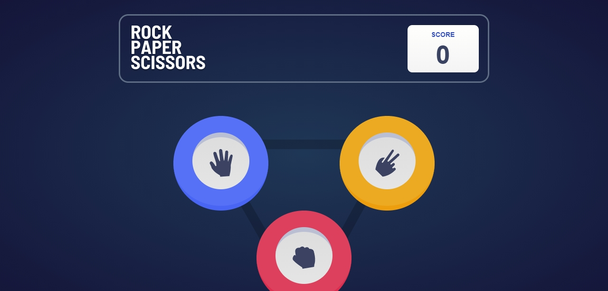

# Frontend Mentor - Rock, Paper, Scissors solution

This is a solution to the [Rock, Paper, Scissors challenge on Frontend Mentor](https://www.frontendmentor.io/challenges/rock-paper-scissors-game-pTgwgvgH). Frontend Mentor challenges help you improve your coding skills by building realistic projects.

## Table of contents

- [Overview](#overview)
  - [The challenge](#the-challenge)
  - [Screenshot](#screenshot)
  - [Links](#links)
- [My process](#my-process)
  - [Built with](#built-with)
  - [Continued development](#continued-development)
- [Author](#author)

## Overview

### The challenge

Users should be able to:

- View the optimal layout for the game depending on their device's screen size
- Play Rock, Paper, Scissors against the computer
- Maintain the state of the score after refreshing the browser _(optional)_

### Screenshot

### Links

- Solution URL: [https://github.com/Adebesin-Cell/Rock-Paper-Scissors-game](https://github.com/Adebesin-Cell/Rock-Paper-Scissors-game)
- Live Site URL: [https://github.com/Adebesin-Cell/Rock-Paper-Scissors-game](https://rock-paper-sci-game.netlify.app/)

## My process

### Built with

- Semantic HTML5 markup
- CSS / SCSS
- Flexbox
- Desktop-first workflow
- Javascript

### Continued development

Use this section to outline areas that you want to continue focusing on in future projects. These could be concepts you're still not completely comfortable with or techniques you found useful that you want to refine and perfect.

- ES6 Features

## Author

- Frontend Mentor - [https://www.frontendmentor.io/profile/Adebesin-Cell](https://www.frontendmentor.io/profile/Adebesin-Cell)
- Twitter - [https://twitter.com/Emmanue21243400](https://twitter.com/Emmanue21243400)
